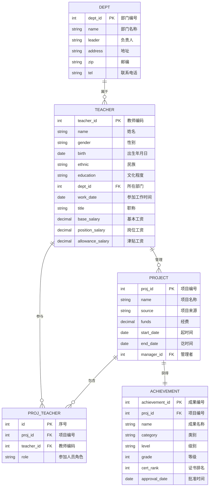

```mermaid
erDiagram
    DEPT ||--o{ TEACHER : "属于"
    TEACHER ||--o{ PROJ_TEACHER : "参与"
    PROJECT ||--o{ PROJ_TEACHER : "包含"
    TEACHER ||--o{ PROJECT : "管理"
    PROJECT ||--|| ACHIEVEMENT : "获得"

    DEPT {
        int dept_id PK "部门编号"
        string name "部门名称"
        string leader "负责人"
        string address "地址"
        string zip "邮编"
        string tel "联系电话"
    }

    TEACHER {
        int teacher_id PK "教师编码"
        string name "姓名"
        string gender "性别"
        date birth "出生年月日"
        string ethnic "民族"
        string education "文化程度"
        int dept_id FK "所在部门"
        date work_date "参加工作时间"
        string title "职称"
        decimal base_salary "基本工资"
        decimal position_salary "岗位工资"
        decimal allowance_salary "津贴工资"
    }

    PROJECT {
        int proj_id PK "项目编号"
        string name "项目名称"
        string source "项目来源"
        decimal funds "经费"
        date start_date "起时间"
        date end_date "讫时间"
        int manager_id FK "管理者"
    }

    PROJ_TEACHER {
        int id PK "序号"
        int proj_id FK "项目编号"
        int teacher_id FK "教师编码"
        string role "参加人员角色"
    }

    ACHIEVEMENT {
        int achievement_id PK "成果编号"
        int proj_id FK "项目编号"
        string name "成果名称"
        string category "类别"
        string level "级别"
        int grade "等级"
        int cert_rank "证书排名"
        date approval_date "批准时间"
    }
```