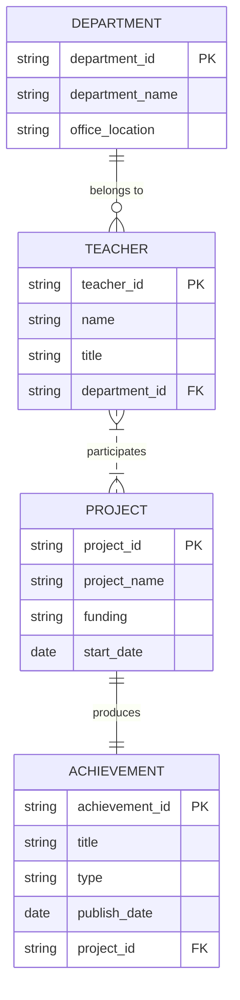

```mermaid
erDiagram
    DEPARTMENT ||--o{ TEACHER : "belongs to"
    TEACHER }|..|{ PROJECT : "participates"
    PROJECT ||--|| ACHIEVEMENT : "produces"

    DEPARTMENT {
        string department_id PK
        string department_name
        string office_location
    }

    TEACHER {
        string teacher_id PK
        string name
        string title
        string department_id FK
    }

    PROJECT {
        string project_id PK
        string project_name
        string funding
        date start_date
    }

    ACHIEVEMENT {
        string achievement_id PK
        string title
        string type
        date publish_date
        string project_id FK
    }

```